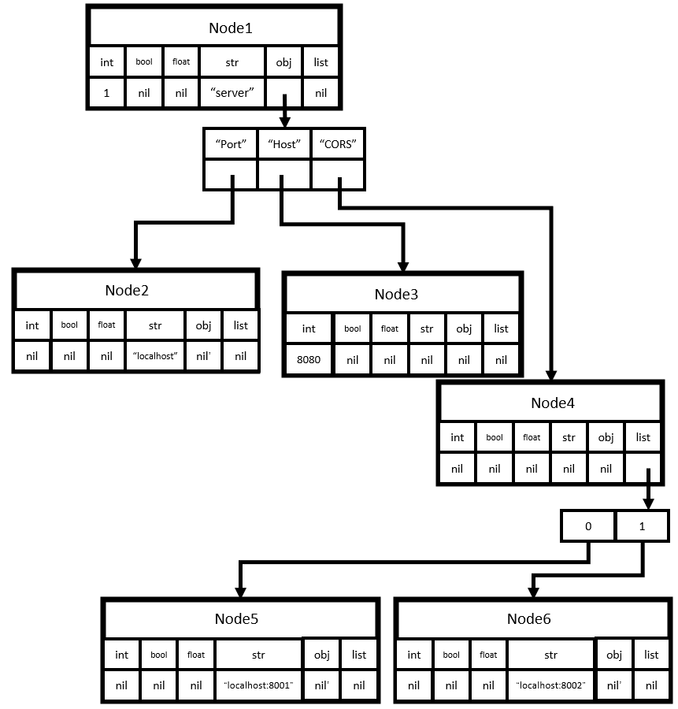
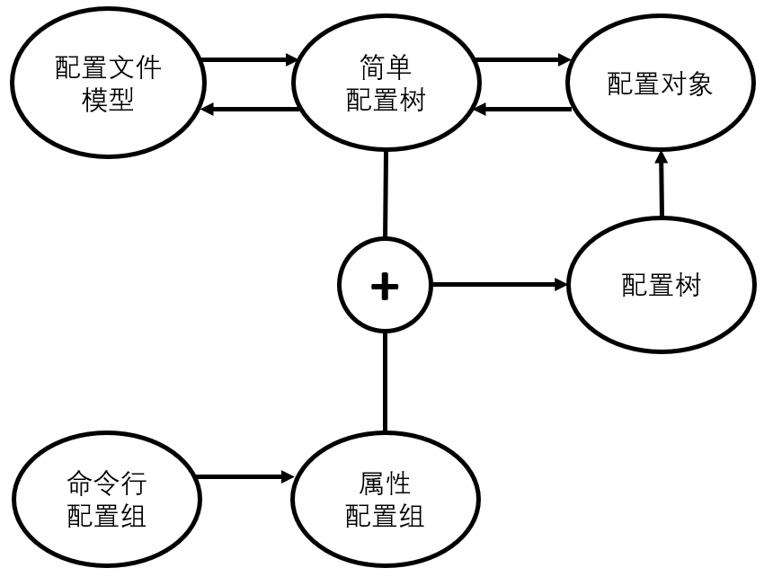

- [基本概念](#基本概念)
  - [配置树](#配置树)
  - [配置对象](#配置对象)
  - [配置文件模型](#配置文件模型)
  - [属性配置](#属性配置)
  - [命令行配置](#命令行配置)
- [整体功能](#整体功能)
  - [内部功能](#内部功能)
  - [外部功能](#外部功能)
- [功能拆解](#功能拆解)
  - [结构体字段的默认值与可空](#结构体字段的默认值与可空)
  - [映射、切片与原型](#映射切片与原型)
  - [映射、切片的覆盖与修改](#映射切片的覆盖与修改)


# 基本概念

## 配置树

我们将一个程序的所有配置项抽象成一个配置树，树的每一个节点是一个`类型->值`的**映射**。其中的类型包括整型、布尔型、浮点型、字符串、对象、列表。

当`类型`为`对象`或`列表`时，值中包含着该节点的子节点。



如果一个节点最多只有一个类型对应的值非nil，则称之为**简单节点**，如上图中的Node2~Node6。

如果一个配置树的所有节点都是简单节点，则称这个树是一个**简单配置树**。

## 配置对象

配置对象是一个Go对象，它可以是整型（int、int8、int16、int32、int64）、浮点型（float32、float64）、布尔型（bool）、字符串（string）、结构体（struct）、切片（slice）、字符串映射（map[string]xxx）、指针（仅支持一级指针和二级指针）。注意数组（array）和接口（interface）是不支持的。

配置对象需要保证指针/空接口指向的对象只能在整个配置对象中出现一次，即将整个配置对象看作一个无向图时，它是一个无环图。

## 配置文件模型

JSON、YAML文件描述的对象模型，本质上是一个树形结构。

## 属性配置

属性配置描述的是两个配置树的区别，通过点`.`分割的路径标识配置项，通过等于号`=`设置配置值。

其中路径中由中括号括起来的数字表示列表的索引，其余表示对象的字段。

对于列表的索引，从0开始计数，单独的数字标识绝对位置的索引，有`+`/`-`前缀的表示相对于列表长度的索引，如`[+0]`表示在列表后追加的第一个元素，`[-1]`表示最后一个元素，`[0]`表示第一个元素。

多个属性配置组成一个**属性配置组**。在同一个属性配置组中，相同的列表相对索引会指向同一个元素，而不会因为靠前的属性配置为列表追加了一个元素使得后面的属性配置中相同的索引指向了列表的不同元素。如属性配置组：

* list.[+0].a=1
* list.[+0].b=2

表示为list列表追加了一个节点，该节点的`对象`类型对应的值中有两个字段，其中a字段的值为1，b字段的值为2。

## 命令行配置

通过命令行输入的属性配置称为**命令行配置**。

通过命令行输入的一系列属性配置称为**命令行配置组**。


# 整体功能

## 内部功能

为配置文件模型、配置对象之间通过简单配置树为中介提供互相转换功能，这三者与配置树之间应当有部分转换的能力。

为命令行配置组提供转换为属性配置组的功能。

提供由配置树和属性配置组生成新的配置树的功能。

提供由配置树转换为配置对象的功能，包括严格匹配（必须由配置树中相应类型进行转换）和非严格匹配（配置树中如果相应类型为nil，则通过一定隐式转换规则使用其它非nil类型的值进行转换）。



## 外部功能

内部功能中的简单配置树、配置树、属性配置组对于用户应该是不可见的。
所以外部主要提供两个功能：

1. 通过配置对象转换成配置文件模型，并将模型按照配置文件的文法进行转换；
2. 解析配置文件，将得到的配置文件模型和命令行配置组绑定到一个配置对象，配置对象绑定前的值作为默认值，将被配置文件模型覆盖，被命令行配置组修改；


# 功能拆解

## 结构体字段的默认值与可空

为了区分配置对象中结构体某个值是空还是默认初始化值，在配置对象中引入了指针。

关于默认值和可空字段，有以下几种情形：

1. 默认非空，但是可空。这种情况下通过一级指针表示，一级指针指向表示默认值的对象即可；
2. 默认非空，且不可空。这种情况直接以对象表示；
3. 默认为空，且非空时没有默认值，通过一级指针表示，但是绑定时该指针应当为nil；
4. 默认为空，但非空时有部分默认值；

关于第4种情况，通过二级指针来表示：

```Go
type Person struct {
    Name string
    Age int
}

type Parent struct {
    Person
    Child **Person
}

var father = Parent{
    Name: "Father",
    Age: 40,
    Child: nil,
}

func init() {
    defaultChild := &Person{
        Name: "Child",
        Age: 12,
    }
    father.Child = &defaultChild
}
```

其生成的模板配置文件为：

```JSON
{
    "Name": "Father",
    "Age": 40,
    "Child": null /*{
        "Name": "Child",
        "Age": 12
    }*/
}
```

若配置文件内容为：

```JSON
{
    "Name": "Bob",
    "Child": {
        "Age": 10
    }
}
```

经过处理后，`father.Name`的值为`"Bob"`，`(*father.Child).Age`的值为10，`(*father.Child).Age`的值为`"Child"`。

若配置文件内容为：

```JSON
{
    "Name": "Bob"
}
```

经过处理后，`father.Name`的值为`"Bob"`，`father.Child`的值为`nil`。


## 映射、切片与原型

对于映射（map）和切片，配置文件模型中可能添加了新的元素，而当添加的新元素具有复杂的结构时，我们希望对其添加一定的默认值。

我们引入**原型**的概念，当为映射和切片添加新的元素时，如果新的元素未指定所有元素的字段时，将使用原型中对应字段的值作为默认值。

映射中，通过添加键为`"__prototype__"`的键值对，来指定原型。

切片中，当切片的容量大于长度时（cap > len），则切片最后一个元素后的一个元素（即下标为len的元素，本身应当为越界元素），将被作为原型。由于这种方式过于hack，所以应当提供封装好的方法来进行这样的构造。

在以下示例中：

```Go
type Tuple struct {
    A int
    B int
}

type Config struct {
    Map map[string]*Tuple
    Slice []Tuple
}

var config = Config{
    Map: map[string]*Tuple{
        "__prototype__": &Tuple{1, 2},
        "Key1": &Tuple{3, 4},
    },
    Slice: []Tuple{
        Tuple{5, 6},
        Tuple{7, 8},
    }[:1:2]
}
```

config对象生成的模板为：

```JSON
{
    "Map": {
        /* prototype
        "key": {
            "A": 1,
            "B": 2
        }
        */
        "Key1": {
            "A": 3,
            "B": 4
        }
    },
    "Slice": [
        /* prototype
        {
            "A": 7,
            "B": 8
        }
        */
        {
            "A": 5,
            "B": 6
        }
    ]
}
```

当config作为配置对象绑定到如下文件时：

```JSON
{
    "Map": {
        "Key1": {
            "A": 11
        },
        "Key2": {
            "A": 22
        },
        "Key3": {
            "A": 33
        }
    },
    "Slice": [
        {
            "A": 44
        },
        {
            "A": 55
        },
        {
            "A": 66
        }
    ]
}
```

效果相当于：

```Go
var config = Config{
    Map: map[string]*Tuple{
        "Key1": &Tuple{11, 4},
        "Key2": &Tuple{22, 2},
        "Key3": &Tuple{33, 2},
    },
    Slice: []Tuple{
        Tuple{44, 6},
        Tuple{55, 8},
        Tuple{66, 8},
    }
}
```

config的Map字段中原先的`"__prototype__"`键值对被删除了，添加了新的键值对`"Key2"`、`"Key3"`，同时，因为配置文件中只提供了Tuple的A的值，所以新添加的键值对将使用原型中描述的B的默认值2。

config的Slice字段中添加了两个新的元素（`{55, 8}`和`{66, 8}`），其中55和66是由配置文件设定的值，而8则是原型提供的默认值。


## 映射、切片的覆盖与修改

在我们为一个映射（map）或切片（slice）提供了默认值后，当配置文件中也对该字段进行了配置时，有两种处理方式：

1. 覆盖。删除整个默认的映射或切片，然后创建新的元素；
2. 修改。不删除默认的部分，重合的部分按照配置文件的内容修改；

通过将元素类型设置为原始类型，表示冲突时通过覆盖来处理；将元素类型设置为指针类型，则表示冲突时通过修改来处理。

对于以下示例：

```Go
type Tuple struct {
    A int
    B int
}

type Config struct {
    CoverMap    map[string]Tuple
    ModifyMap   map[string]*Tuple
    CoverSlice  []Tuple
    ModifySlice []*Tuple
}

var config Config{
    CoverMap: map[string]Tuple{
        "Key1": Tuple{ A: 1, B: 2 },
        "Key2": Tuple{ A: 3, B: 4 }
    },
    ModifyMap: map[string]Tuple{
        "Key1": &Tuple{ A: 1, B: 2 },
        "Key2": &Tuple{ A: 3, B: 4 }，
    },
    CoverSlice: []Tuple{
        Tuple{ A: 1, B: 2 },
        Tuple{ A: 3, B: 4 },
    },
    ModifySlice: []*Tuple{
        &Tuple{ A: 1, B: 2 },
        &Tuple{ A: 3, B: 4 },
    },
}
```

生成的配置文件模板如下：

```JSON
{
    /*
    "CoverMap": {
        "Key1": {
            "A": 1,
            "B": 2
        },
        "Key2": {
            "A": 3,
            "B": 4
        }
    },
    */
    "ModifyMap": {
        "Key1": {
            "A": 1,
            "B": 2
        },
        "Key2": {
            "A": 3,
            "B": 4
        }
    },
    /*
    "CoverSlice": [
        {
            "A": 1,
            "B": 2
        },
        {
            "A": 3,
            "B": 4
        }
    ],
    */
    "ModifySlice": [
        {
            "A": 1,
            "B": 2
        },
        {
            "A": 3,
            "B": 4
        }
    ]
}
```

因为通过覆盖方式提供的配置项，我们往往希望用户使用默认配置，并且用户只要进行了一点修改就会导致所有默认值被删除，代价较大，所以在生成的配置文件模板中，默认将其注释。

当使用如下配置文件时：

```JSON
{
    "CoverMap": {
        "Key1": {
            "A": 5
        }
    },
    "ModifyMap": {
        "Key1": {
            "A": 5
        }
    },
    "CoverSlice": [
        {
            "A": 5
        }
    ],
    "ModifySlice": [
        {
            "A": 5
        }
    ]
}
```

其效果相当于：

```Go
var config Config{
    CoverMap: map[string]Tuple{
        "Key1": Tuple{ A: 5, B: 0 }
    },
    ModifyMap: map[string]Tuple{
        "Key1": &Tuple{ A: 5, B: 2 },
        "Key2": &Tuple{ A: 3, B: 4 }，
    },
    CoverSlice: []Tuple{
        Tuple{ A: 5, B: 0 },
    },
    ModifySlice: []*Tuple{
        &Tuple{ A: 5, B: 2 },
        &Tuple{ A: 3, B: 4 },
    },
}
```

可见在覆盖的方式下，配置文件中未出现的项被删除了，值得注意的是，覆盖方式下，配置文件未提供的值将被默认初始化（B被初始化为0），这种默认初始化可以通过设置`原型`来为其提供默认值。

而在修改的方式下，配置文件中出现的项被修改了，而其它项没有改变。

值得注意的是，在覆盖方式下，以下配置文件会导致映射/切片被清空（长度变为0）：

```JSON
{
    "CoverMap1": {},
    "CoverSlice1": [],
}
```

在覆盖的方式下，提供与默认值完全相同的配置文件，是否会进行删除和重新创建是未定义的，但是结果应当是相同的。换言之，提供与默认值完全相同的配置文件，是否会造成性能损失是未定义的。


